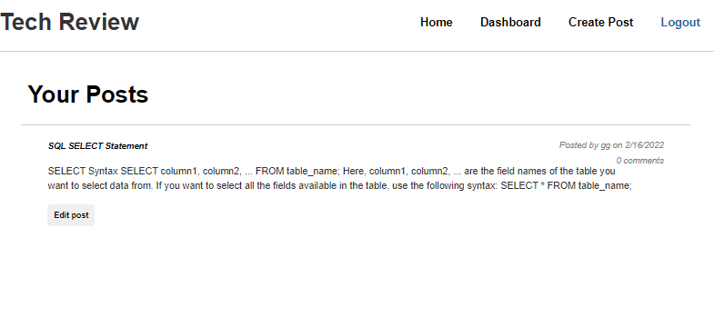

<h1 align="center">Tech Blog with Model-View-Controller (MVC) architectural structure </h1>
  

## Description
This application A tech blog which allows the developers to publish blog posts, make comments and create accounts using MVC architectural structure, Handlebars.js, Sequelize.. This application is deployed through Heroku.

## Table of Contents
- [Description](#description)
- [Table of Contents](#table-of-contents)
- [Installation](#installation)
- [Usage](#usage)
- [Deployed Link](#deployed-link)
- [Demo](#demo)
- [Built With](#built-with)
- [License](#license)
- [Contributing](#contributing)
- [Tests](#tests)
- [Questions](#questions)

## Installation
`git clone` the repo to your local machine. To use this application, please run the following command:

`npm init` -- creates a package.json file for your application.

And then run the following commands to install the dependencies: 

`npm install`

`npm install express`

## Usage
Type the following command in your termimal:

`npm start`

Then open your browser and type http://localhost:3001/ to run this application on your local machine.

## Deployed Link
The link to the deployed application is: #.

## Demo
Below is the demostration of this application:

Screenshot of dashboard:

Screenshot of a single post:

**[⬆ back to top](#table-of-contents)**

## Built With

* [HTML](https://developer.mozilla.org/en-US/docs/Web/HTML)
* [CSS](https://developer.mozilla.org/en-US/docs/Web/CSS)
* [Javascript](https://developer.mozilla.org/en-US/docs/Web/Javascript)
* [NodeJS](https://nodejs.org/en/)
* [ExpressJS](https://expressjs.com/)
  
**[⬆ back to top](#table-of-contents)**

## License
This application is licensed under MIT license. 

**[⬆ back to top](#table-of-contents)**

## Contributing
This application is developed by Baofeng Guo. If you would like to contribute it, please follow the guidelines for how to do so.

**[⬆ back to top](#table-of-contents)**

## Tests
To run tests on the application, run

`npm install jest`

and then `npm run test` from the command line.

**[⬆ back to top](#table-of-contents)**

## Questions
For any question, please contact me on GitHub: [magickw](https://github.com/magickw) or email me at peterguo1983@gmail.com.

**[⬆ back to top](#table-of-contents)**

